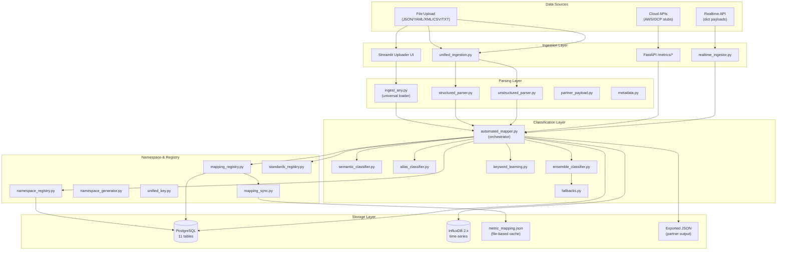
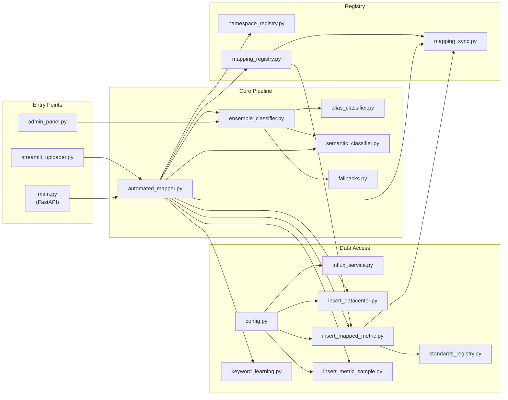
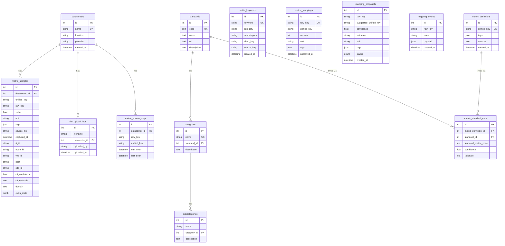

# Current CIM Architecture — GreenDIGIT

> **Generated**: 2026-06-10 · **Scope**: Full architecture audit (read-only)

---

## 1. System Overview

The GreenDIGIT CIM (Common Information Model) system is a **metric ingestion, classification, and normalization pipeline** for data center sustainability metrics. It takes heterogeneous metric data from multiple partners (cloud, grid, network providers) in varied formats and maps them into a unified namespace (`gd.category.subcategory.short_key`).

### High-Level Architecture



---

## 2. Technology Stack

| Layer | Technology | Purpose |
|-------|-----------|---------|
| **API** | FastAPI + Uvicorn | REST endpoints for ingestion & query |
| **UI** | Streamlit (2 apps) | File upload portal + Admin review panel |
| **ORM** | SQLAlchemy 2.0 | PostgreSQL access (11 tables) |
| **Config** | pydantic-settings + python-dotenv | Environment-based configuration |
| **Time-Series** | InfluxDB 2.x (influxdb-client) | Metric value storage + Flux queries |
| **RDBMS** | PostgreSQL 15 | Metadata, taxonomy, mappings, audit trail |
| **Classification** | RapidFuzz + sentence-transformers | Fuzzy matching + embedding similarity |
| **Parsing** | json, PyYAML, xml.etree, csv | Multi-format file parsing |
| **CI** | GitHub Actions | Automated testing pipeline |
| **Containerization** | Docker Compose | PostgreSQL + InfluxDB services |

---

## 3. Core Architectural Patterns

### 3.1 Dual Storage Architecture

The system uses **two complementary databases**:

1. **PostgreSQL** (via SQLAlchemy) — stores:
   - Taxonomy hierarchy (standards → categories → subcategories)
   - Metric definitions (unified keys, sources, tags)
   - Metric samples (per-observation records with classification metadata)
   - Mapping audit trail (proposals, events, source maps)
   - Datacenter registry + upload logs
   - Keyword learning cache

2. **InfluxDB** — stores:
   - Time-series metric values (measurement=unified_key, value=float, tags, timestamp)
   - Used for range queries and analytics

3. **JSON file** (`metric_mapping.json`) — acts as:
   - Fast-path cache for raw→unified lookups
   - Synchronization artifact between DB state and runtime

### 3.2 Classification Pipeline (Ensemble)

The system employs a **cascading classifier** in `ensemble_classifier.py`:

```
Priority Chain:
  1. semantic_classifier   → Exact suffix match against 10 known patterns (conf=0.90)
  2. alias_classifier      → Fuzzy match (RapidFuzz WRatio ≥ 88) against ~80 aliases (conf=0.85+)
  3. rule_guess            → Token intersection rules (conf=0.60–0.80)
  4. embed_guess           → Sentence-transformer cosine similarity ≥ 0.60 (optional)
  5. fallback              → Returns ("uncategorized", "unknown", "unknown", 0.0)
```

**Problem**: `automated_mapper.py` contains a **parallel, independent `_classify_to_parts()`** function (L55–130) that duplicates the ensemble pipeline with its own rules, effectively creating two competing classification paths.

### 3.3 Namespace Convention

All unified metric keys follow the pattern:
```
gd.<category>.<subcategory>.<short_key>
```

Examples:
- `gd.energy.consumption.total`
- `gd.performance.cpu.utilization`
- `gd.environment.temperature.interior`
- `gd.network.traffic.incoming`

The `to_gd()` utility normalizes any key format into this 4-part structure.

### 3.4 Auto-Learning

When classification confidence ≥ 0.85:
- The raw_key → (category, subcategory, short_key) mapping is stored in `metric_keywords`
- Next occurrence is resolved via DB lookup (O(1)) before fuzzy matching

### 3.5 Standards Linkage

After classification, unified keys are matched to sustainability standards via rule-based inference:
- `gd.energy.efficiency.pue` → TGG-PUE (conf=0.99)
- `gd.environment.emissions.*` → GHG (conf=0.85)
- `gd.energy.*` → ISO-50001 (conf=0.60, umbrella)
- `gd.environment.temperature.*` → ASHRAE-TC9.9-2021 (conf=0.80)

---

## 4. Module Dependency Graph



---

## 5. Database Schema (PostgreSQL — 11 Tables)



---

## 6. Existing Strengths

| Strength | Evidence |
|----------|----------|
| **Multi-format support** | Handles JSON, YAML, XML, CSV, TXT, NDJSON, partner payloads — graceful fallbacks |
| **Cascading classification** | 5-level ensemble: semantic → alias → rules → embeddings → fallback |
| **Self-learning** | High-confidence classifications auto-persist to `metric_keywords` for O(1) future lookups |
| **Standards linkage** | Automated rule-based mapping to 12 sustainability standards (TGG, GHG, ISO, ASHRAE, IEEE, etc.) |
| **Atomic JSON sync** | `mapping_sync.py` uses temp-file + os.replace for crash-safe writes |
| **Admin review workflow** | Streamlit admin panel allows human review of uncategorized metrics with retrofix capability |
| **Flexible metadata extraction** | Deep-scan strategy handles arbitrary JSON nesting; partner-generic strategy handles cloud/grid/network payloads |
| **Audit trail** | `MappingEvent` table provides append-only history; `MappingProposal` supports proposal/approval workflow |
| **Dual storage** | PostgreSQL for metadata + InfluxDB for time-series — appropriate separation of concerns |
| **gd.* namespace convention** | Consistent 4-part unified key format across all outputs |
