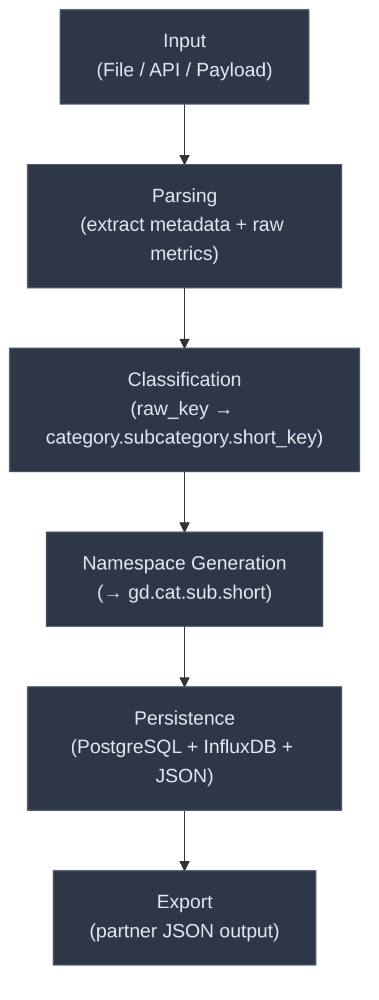
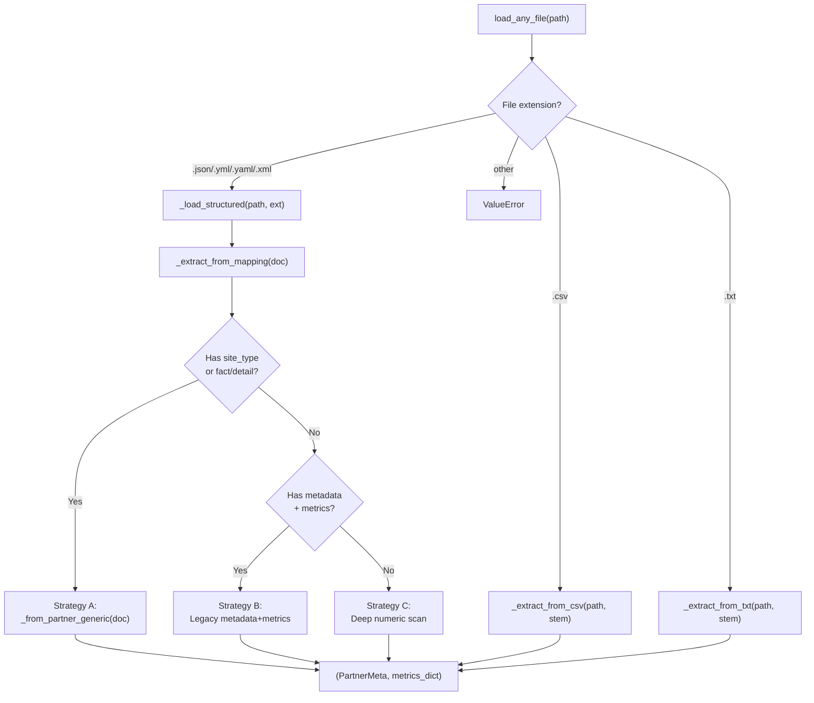
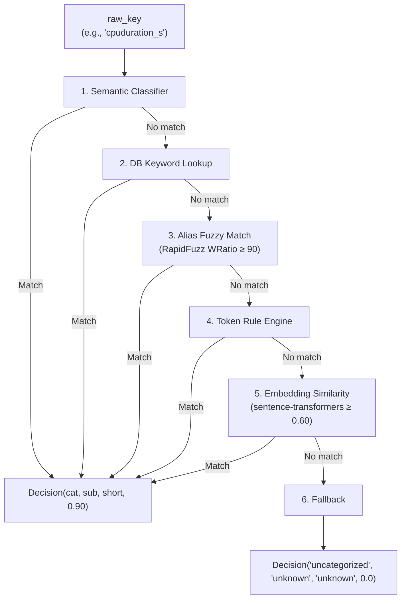
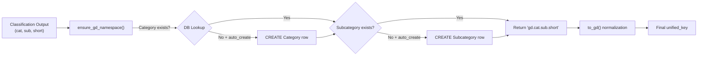
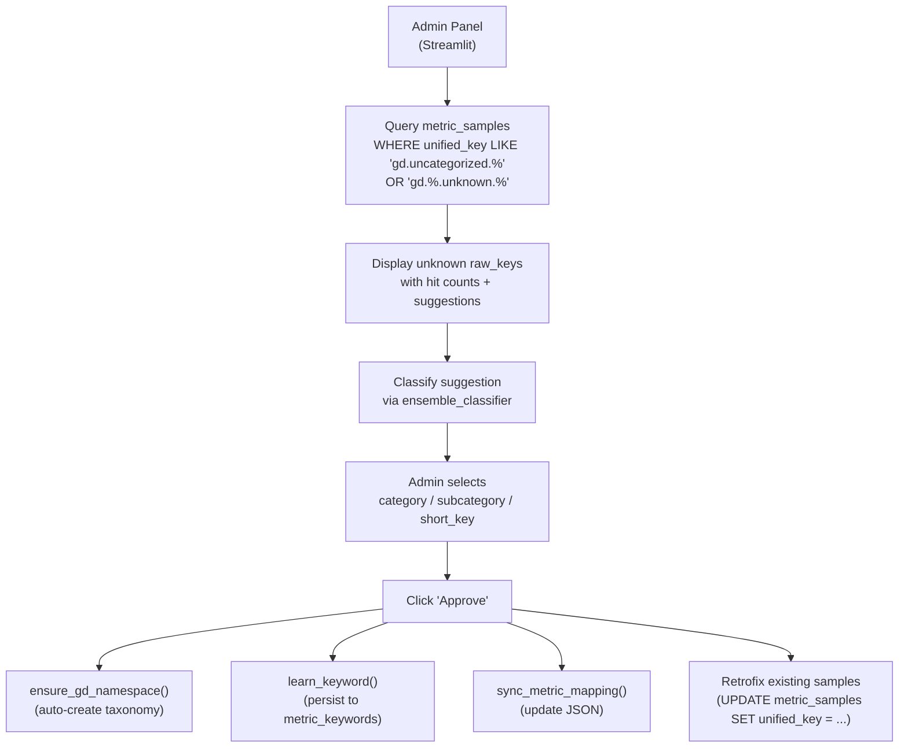

# Current Data Flow — GreenDIGIT CIM

> **Generated**: 2026-06-10 · **Scope**: End-to-end data flow audit (read-only)

---

## 1. Data Flow Overview



---

## 2. Entry Points

There are **four distinct ingestion entry points**, each with a slightly different flow:

### 2.1 Streamlit Uploader (`streamlit_uploader.py`)

**Primary production path.** Handles file uploads from the Streamlit UI.

```
User uploads file → save to temp path
  → load_any_file(temp_path)                    # ingest_any.py
  → for each (raw_key, value) in raw_metrics:
      → process_metric_sample(...)               # automated_mapper.py
          → classify_metric(raw_key)             # ensemble_classifier.py
          → ensure_gd_namespace(cat, sub, short) # namespace_registry.py
          → register_mapping(...)                # mapping_registry.py
          → insert_mapped_metric(...)            # insert_mapped_metric.py
          → insert_metric_sample(...)            # insert_metric_sample.py
          → sync_metric_mapping(...)             # mapping_sync.py
          → learn_keyword(...)                   # keyword_learning.py (if conf ≥ 0.85)
  → write_mapped_metrics(new_mapped, ts)         # influx_service.py
  → insert_file_upload_log(...)                  # insert_file_upload_log.py
  → write_external_metrics_json(...)             # external_json.py
  → insert_metric_definition(...)                # insert_metric_definition.py (duplicated)
```

### 2.2 File-Based Ingestion (`unified_ingestion.py`)

**Legacy/alternative path.** Uses the older `parse_and_extract_file_metrics()`.

```
ingest_from_file(file_path, datacenter_name)
  → insert_datacenter(name)
  → parse_and_extract_file_metrics(file_path)   # namespace_mapper_core.py
      → parse_structured_file() or parse_unstructured_text()
  → for each (raw_key, value):
      → process_metric_sample(...)               # automated_mapper.py
  → build_metadata(...) + write_external_metrics_json(...)
  → write_mapped_metrics(new_mapped, ts)         # influx_service.py
  → insert_file_upload_log(datacenter_id=1)      # ⚠️ HARDCODED
  → insert_metric_definition(...)                # per unified_key
```

### 2.3 FastAPI Endpoints (`api/metrics.py`)

**Stub path.** Currently returns hardcoded values.

```
GET /metrics/aws → ingest_aws_metrics()
  → fetch_from_aws() → {"CPUUtilization": 12.3, "FreeableMemory": 2048}
  → for each raw_key:
      → map_raw_to_unified(raw_key, val)        # namespace_mapper.py (JSON lookup only)
      → write_metrics(batch)                     # influx_service.py

GET /metrics/gcp → ingest_gcp_metrics()
  → (same pattern)
```

### 2.4 Realtime API Ingestion (`realtime_ingestor.py`)

**Programmatic path** for API-sourced metrics.

```
ingest_from_api(metric_data, datacenter_name)
  → extract_metrics(metric_data, datacenter_name) # namespace_mapper_core.py
      → map_raw_to_unified(raw_key, val)           # JSON lookup only
  → write_metrics(batch)                           # influx_service.py
  → insert_file_upload_log(datacenter_id=1)        # ⚠️ HARDCODED
  → insert_metric_definition(...)                  # per unified_key
```

---

## 3. Parsing Stage (Detail)

### 3.1 Universal Loader (`ingest_any.py`)

The most robust path. `load_any_file(path)` returns `(PartnerMeta, Dict[str, float])`.



**Three extraction strategies for structured files:**

| Strategy | Trigger | Description |
|----------|---------|-------------|
| **A: Partner Generic** | `site_type` or `fact` or `detail` in doc | Handles cloud/grid/network payloads from EGI/IFCA partners |
| **B: Legacy Metadata** | `metadata` + `metrics` keys in doc | Handles `{metadata: {...}, metrics: {...}}` shape |
| **C: Deep Scan** | Default fallback | Recursively flattens all numeric leaves; guesses domain from key names |

### 3.2 Structured Parser (`structured_parser.py`)

Used by the `unified_ingestion.py` path. Flattens all numeric values:
- JSON → single doc / list / NDJSON / YAML fallback
- YAML → `safe_load_all` multi-doc support
- CSV → row-column keying (`row0.cpu_usage`)
- XML → recursive element traversal

### 3.3 Unstructured Parser (`unstructured_parser.py`)

Regex-based extraction from free-form English text:
- Matches patterns like "CPU usage at 87.3%", "Memory used is 10.5 GB"
- Returns `{datacenter.cpu: 87.3, datacenter.memory: 10.5, ...}`
- Only 6 patterns: cpu, memory, power, network.in, network.out, temperature

---

## 4. Classification Stage (Detail)



### Classifier details:

| # | Classifier | Source | Entries | Confidence |
|---|-----------|--------|---------|------------|
| 1 | Semantic Map | `semantic_classifier.py` | 10 hardcoded rules | 0.90 |
| 2 | DB Keywords | `metric_keywords` table | Dynamic (learned) | From DB |
| 3 | Alias Fuzzy | `alias_classifier.py` | ~80 hardcoded aliases | 0.85+ |
| 4 | Token Rules | `ensemble_classifier.py` L30–74 | ~20 rule sets | 0.60–0.80 |
| 5 | Embeddings | `ensemble_classifier.py` L76–97 | 10 candidate phrases | 0.60+ |
| 6 | Fallback | `fallbacks.py` | Token slugging | 0.0 |

> **⚠️ Duplication**: `automated_mapper.py._classify_to_parts()` (L55–130) contains a **separate copy** of the classification chain (semantic → DB keywords → alias → token rules) that runs **in addition to** the ensemble call on L166. The function is defined but only used internally; the main flow calls `classify_metric()` from the ensemble.

---

## 5. Namespace Generation Stage



**Guard**: uncategorized/unknown taxonomy is **not** auto-created to avoid polluting the DB.

---

## 6. Persistence Stage

After classification + namespace generation, **6 writes** occur per metric:

| # | Target | Function | What's Written |
|---|--------|----------|----------------|
| 1 | `datacenters` (PG) | `get_or_create_datacenter_id()` | Datacenter row |
| 2 | `metric_definitions` (PG) | `insert_mapped_metric()` | Unified key + sources + tags |
| 3 | `metric_standard_map` (PG) | `attach_standard()` | Standard linkage + confidence |
| 4 | `metric_samples` (PG) | `insert_metric_sample()` | Per-observation row with metadata |
| 5 | `metric_source_map` (PG) | Inside `insert_metric_sample()` + `register_mapping()` | Per-DC raw→unified tracking |
| 6 | `metric_mapping.json` (File) | `sync_metric_mapping()` | JSON cache update |
| 7 | `metric_keywords` (PG) | `learn_keyword()` | Auto-learned classification (if conf ≥ 0.85) |
| 8 | `metric_mappings` (PG) | `register_mapping()` → not actually written | **Note**: `MetricMapping` model exists but `register_mapping()` doesn't write to it |

**After per-metric loop:**

| # | Target | Function |
|---|--------|----------|
| 9 | InfluxDB | `write_mapped_metrics()` |
| 10 | `file_upload_logs` (PG) | `insert_file_upload_log()` |
| 11 | Export JSON file | `write_external_metrics_json()` |
| 12 | `metric_definitions` (PG) | `insert_metric_definition()` — **redundant** with step 2 |

---

## 7. Query / Output Flow

### 7.1 InfluxDB Query API

```
GET /query/?measurement=gd.energy.consumption.total&start=-24h&region=eu-west
  → query_metrics(measurement, start, stop, **filters)
  → Flux query construction → client.query_api().query_data_frame()
  → Return list of dicts
```

### 7.2 Export JSON

Each ingestion run produces a JSON file in `cloud_metrics/data/exports/`:
```json
{
  "metadata": {
    "site_id": "aws-eu-central-1.exec-cloud-001",
    "datacenter": "aws-eu-central-1-cloud-site",
    "timestamp": "2025-09-18T11:00:00",
    ...
  },
  "metrics": {
    "gd.energy.consumption.total": 1180.2,
    "gd.performance.time.wallclock": 7200,
    ...
  }
}
```

### 7.3 Mapping JSON Rebuild

```
scripts/rebuild_mapping_json.py
  → exporters/rebuild_mapping_json.rebuild_mapping()
  → Query MetricSourceMap (primary) or MetricKeyword (fallback)
  → Write to cloud_metrics/data/metric_mapping.json
```

**Note**: Two different `metric_mapping.json` files exist:
1. `cloud_metrics/mapping/metric_mapping.json` — runtime mapping (simple `{unified: [raw_keys]}` format)
2. `cloud_metrics/data/metric_mapping.json` — exported mapping (richer `{raw_key: {unified_key, last_seen}}` format)

---

## 8. Admin Review Flow


