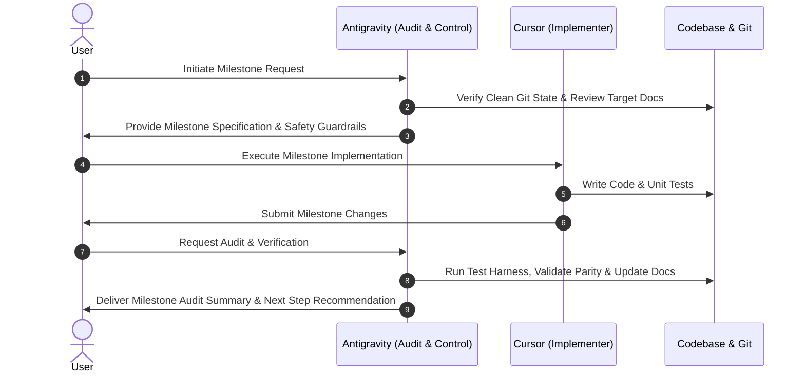

# Dual-Agent Refactoring Workflow & Governance

This document establishes the operational rules, role definitions, separation of concerns, and collaboration protocols for executing the Common Information Model (CIM) registry-driven refactoring using a dual-agent architecture (**Cursor** and **Antigravity**).

---

## 1. Primary Agent Roles & Responsibilities

To ensure predictable execution, avoid race conditions, and guarantee high code quality, responsibilities are strictly partitioned between the two AI agents:

| Dimension | Cursor (Implementation Agent) | Antigravity (Audit & Control Agent) |
| :--- | :--- | :--- |
| **Primary Scope** | Codebase refactoring, module implementation, feature creation, schema edits. | Architectural audit, code review, documentation maintenance, test validation, E2E verification. |
| **Code Modifications** | Primary author for source code (`cloud_metrics/`), models, services, routers, and scripts during milestones. | Audit and review source code; maintain target documentation (`docs/`), planning files, and test specs. |
| **Testing Responsibilities** | Writes unit tests corresponding to newly created implementation logic. | Executes test suites (`pytest`), validates test coverage, verifies database isolation and E2E pipeline state. |
| **Documentation** | Updates inline docstrings and module comments for created functions. | Authors and updates target architecture docs, gap analyses, README, control plans, and milestone summaries. |
| **Execution Trigger** | Executes code edits during assigned implementation milestones. | Performs pre-milestone reviews and post-milestone audits and verifications. |

---

## 2. Core Governance Principles

### Rule 1: Single-Writer Principle
* **Only one agent may modify implementation source files during an active milestone.**
* While Cursor is modifying files in `cloud_metrics/` or `migrations/`, Antigravity will not perform concurrent edits on implementation files.
* Antigravity reviews, audits, and generates validation documentation without interfering with active code changes.

### Rule 2: Clean Git State Requirement
* **Every milestone must begin from a clean Git working tree.**
* Before starting a milestone:
  1. All untracked changes from previous stages must be committed, stashed, or safely cleaned.
  2. `git status` must confirm zero uncommitted modifications.
  3. The current HEAD commit must be verified against the milestone baseline.

### Rule 3: Preservation of Existing Functionality
* Legacy endpoints, parsers, classifiers, and data structures must remain fully functional unless an approved milestone explicitly deprecates or replaces them.
* Backward compatibility wrappers must be added wherever function signatures or data structures are refactored.

### Rule 4: Non-Destructive Command Execution
* No destructive git operations (e.g., `git reset --hard`, `git push --force`, `git clean -fd`), database drops, or file removals are allowed without explicit user approval.

---

## 3. Milestone Execution Lifecycle

Each implementation milestone follows a structured 5-step lifecycle:

---

## 4. Required Milestone Summary Standard

At the conclusion of every milestone, a comprehensive summary must be produced containing the following six standardized fields:

1. **Files Created**: Exact relative paths of all newly created files.
2. **Files Modified**: List of modified existing files with high-level description of changes.
3. **Tests Added**: Specific test files and test functions created or updated.
4. **Tests Passed / Failed**: Full execution output of `pytest` (e.g., `21 passed, 0 failed`).
5. **Identified Risks**: Any technical debt, edge cases, performance considerations, or compatibility warnings.
6. **Next Recommended Step**: Explicit pointer to the next stage in `docs/target/IMPLEMENTATION_SEQUENCE.md`.
