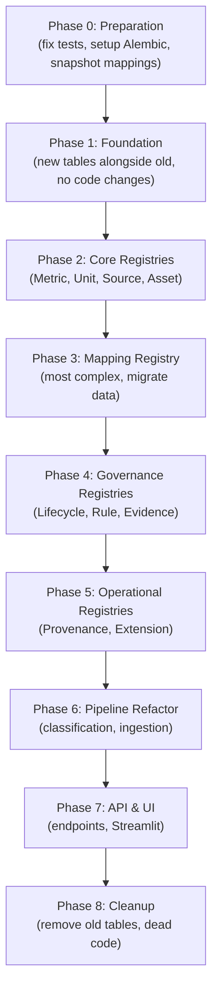
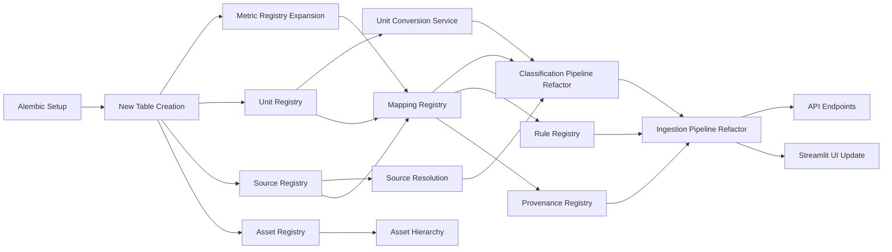

# Refactoring Risks

> **Generated**: 2026-06-10 · **Scope**: Risk assessment for migrating from current to target architecture

---

## 1. Risk Dashboard

| # | Risk | Likelihood | Impact | Severity | Mitigation |
|---|------|:---:|:---:|:---:|---|
| R1 | Data loss during schema migration | Medium | 🔴 Critical | 🔴 High | Alembic migrations + backup before each migration |
| R2 | Mapping regression (metrics classified differently) | High | 🔴 Critical | 🔴 High | Snapshot current mappings, run A/B comparison |
| R3 | InfluxDB data orphaned after key format changes | Low | 🟡 Medium | 🟡 Medium | Keep unified_key format identical (`gd.*`) |
| R4 | Breaking the Streamlit UI during refactor | Medium | 🟡 Medium | 🟡 Medium | Refactor service layer first, UI last |
| R5 | Circular import hell from model consolidation | Medium | 🟡 Medium | 🟡 Medium | Careful model import ordering, use strings for FK |
| R6 | Performance regression from registry lookups | Low | 🟡 Medium | 🟢 Low | Cache registry queries, benchmark before/after |
| R7 | Seed data inconsistencies after migration | Medium | 🟡 Medium | 🟡 Medium | Automated seed validation tests |
| R8 | Dual system period (old + new running together) | Medium | 🟡 Medium | 🟡 Medium | Feature flags, phased rollout |
| R9 | Loss of auto-learning capability | Low | 🟡 Medium | 🟢 Low | Migrate keyword_learning to Mapping Registry service |
| R10 | Test suite becomes untestable during migration | Medium | 🟡 Medium | 🟡 Medium | Fix broken tests first, add new tests alongside |

---

## 2. Detailed Risk Analysis

### R1: Data Loss During Schema Migration

**What could go wrong**: Adding columns to `metric_definitions`, migrating `datacenters` → `assets`, merging `metric_source_map` + `metric_keywords` → `cim_mappings` could lose data if migrations are misconfigured.

**Current data at risk**:
- `metric_definitions` — all unified key definitions with tags/sources
- `metric_samples` — all observation records
- `metric_keywords` — all auto-learned mappings
- `metric_source_map` — per-DC raw→unified tracking
- `datacenters` — datacenter registry
- `standards` + `metric_standard_map` — standards linkage

**Mitigation strategy**:
1. Set up Alembic **before any schema changes**
2. Create initial migration that snapshots current schema
3. Use `ADD COLUMN ... DEFAULT NULL` for new fields (non-destructive)
4. Use `CREATE TABLE IF NOT EXISTS` for new registry tables
5. Use data migration scripts to copy/transform data from old tables to new
6. Keep old tables during transition period; drop only after validation
7. Always `pg_dump` before each migration

**Rollback plan**: Alembic `downgrade` + restore from `pg_dump`

---

### R2: Mapping Regression

**What could go wrong**: Changing the classification pipeline — moving from hardcoded dicts to Mapping Registry queries — could cause different classification results for the same raw keys.

**Current classification paths**:
1. `ensemble_classifier.classify_metric()` — 5-layer cascade
2. `automated_mapper._classify_to_parts()` — 4-layer cascade (duplicate)

**Scenarios**:
- A raw key that was `exactMatch` via the alias dict might become `closeMatch` via fuzzy matching against Mapping Registry rows
- Fuzzy cutoff changes (88 vs 90) could cause edge-case differences
- Missing seed data in Mapping Registry could cause regressions

**Mitigation strategy**:
1. **Snapshot current mappings**: Before any changes, dump ALL current raw→unified mappings from `metric_source_map` + `metric_keywords` + `metric_mapping.json`
2. **Create regression test**: Script that runs every known raw key through the old classifier AND the new classifier, compares outputs
3. **Migrate ALL existing data**: Every alias, keyword, and mapping becomes a Mapping Registry row **before** switching the classifier to registry-first
4. **A/B comparison mode**: Run both old and new classifier in parallel, log disagreements, only switch when disagreement rate is 0%

---

### R3: InfluxDB Data Orphaned

**What could go wrong**: If the unified_key format changes (e.g., from `gd.energy.consumption.total` to something else), existing InfluxDB measurements would become unreachable.

**Assessment**: **Low risk** — the target architecture retains the `gd.*` namespace convention. No format change is planned.

**Mitigation**: 
- Do NOT change the `gd.*` key format
- If future changes require format updates, create a one-time InfluxDB data migration script

---

### R4: Breaking the Streamlit UI

**What could go wrong**: The Streamlit uploader and admin panel directly call services that will be refactored. Changing function signatures, model fields, or import paths will break the UI.

**Affected files**:
- `streamlit_uploader.py` — calls `process_metric_sample()`, `write_mapped_metrics()`, `build_metadata()`, `write_external_metrics_json()`, `insert_file_upload_log()`, `insert_metric_definition()`
- `admin_panel.py` — calls `classify_metric()`, `ensure_gd_namespace()`, `learn_keyword()`, `sync_metric_mapping()`, queries `MetricSample`, `Category`, `Subcategory`, `Datacenter`

**Mitigation strategy**:
1. Refactor service layer first (models, services, classifiers)
2. Keep backward-compatible function signatures during transition (add new parameters with defaults)
3. Update UI scripts **last**, after service layer is stable
4. Add integration tests for UI-service boundary before refactoring

---

### R5: Circular Import Issues

**What could go wrong**: Consolidating 11+ models into a registry system with cross-references creates import cycles. This already exists: `insert_mapped_metric` imports `standards_registry` which imports `MetricDefinition` which is in the same package.

**Current problem areas**:
- `models/__init__.py` imports all models
- `services/insert_mapped_metric.py` lazily imports `standards_registry`
- Multiple files do `sys.path.insert(0, ...)` at import time

**Mitigation strategy**:
1. Use string-based FK references (`ForeignKey("assets.id")`) instead of model imports
2. Group models by registry (one module per registry)
3. Use lazy imports for cross-registry service calls
4. Remove all `sys.path.insert()` hacks — install package properly with `pip install -e .`

---

### R6: Performance Regression

**What could go wrong**: Replacing in-memory dict lookups (alias classifier, semantic classifier) with database queries could slow down classification.

**Current performance**:
- Alias fuzzy match: O(n) over ~80 entries in memory (~0.5ms)
- Semantic match: O(n) over 10 entries in memory (~0.1ms)
- DB keyword lookup: 1 SQL query (~5–10ms)

**Target performance**:
- Mapping Registry lookup: 1 SQL query (~5–10ms) — but replaces multiple steps
- Classifier fallback: Same as current

**Assessment**: Net impact is likely **neutral to slightly slower** for first-time classifications, but **faster** for repeat classifications (Mapping Registry hit = 1 query vs. current cascade of 3–5 steps).

**Mitigation strategy**:
1. Add caching layer (LRU or Redis) for Mapping Registry lookups
2. Benchmark before/after with representative dataset
3. Keep alias dict as in-memory fallback if registry query is too slow
4. Index `cim_mappings.source_key` for fast lookups

---

### R7: Seed Data Inconsistencies

**What could go wrong**: Migrating ~180 hardcoded entries (aliases, semantic map, keyword seeds) into Mapping Registry rows could introduce inconsistencies — duplicate entries, conflicting relation_types, mismatched confidence scores.

**Example conflict**:
- `alias_classifier.py`: "efficiency" → `performance.efficiency.compute`
- `semantic_classifier.py`: No entry for "efficiency"
- `seed_taxonomy_standards.py`: "efficiency" → `gd.performance.efficiency.compute`
- Are these the same mapping? Different confidence levels? Different relation_types?

**Mitigation strategy**:
1. Write a migration script that deduplicates entries by source_key
2. Prefer the highest-confidence entry when conflicts arise
3. Mark conflicts as `status=underReview` for human resolution
4. Create a validation test that checks for duplicate source_keys in Mapping Registry

---

### R8: Dual System Period

**What could go wrong**: During migration, some code paths use old tables (metric_source_map, metric_keywords) while others use the new Mapping Registry. Writes to one may not appear in the other, causing inconsistent state.

**Mitigation strategy**:
1. **Phase 1**: Create new tables alongside old ones. New services write to BOTH.
2. **Phase 2**: Switch read path to new tables. Keep writes to both.
3. **Phase 3**: Remove writes to old tables. Old tables become read-only.
4. **Phase 4**: Drop old tables after validation period.
5. Use feature flags to control which path is active.

---

### R9: Loss of Auto-Learning

**What could go wrong**: The current `keyword_learning.py` writes to `metric_keywords` when classification confidence ≥ 0.85. If this table is removed before the new Mapping Registry auto-learning is in place, the system loses self-improvement.

**Mitigation**: 
- Implement Mapping Registry auto-learning **before** removing `metric_keywords`
- Port the confidence threshold logic to the new service
- Verify the new service writes to `cim_mappings` with `origin=auto-learned`

---

### R10: Test Suite During Migration

**What could go wrong**: The current test suite is already 50% broken (`test_sql_service.py` imports nonexistent module, `test_namespace_mapper.py` expects old keys). During migration, model changes will break the remaining tests.

**Mitigation strategy**:
1. Fix broken tests **first** (before any migration)
2. Add new registry tests alongside migration
3. Use a separate test configuration with SQLite in-memory for fast iteration
4. Run tests continuously during migration (CI pipeline)

---

## 3. Migration Order (Risk-Minimized)

Based on the risk analysis, the safest migration order is:

| Phase | Risk Level | Rollback Difficulty | Duration |
|-------|:---:|:---:|---|
| 0: Preparation | 🟢 Low | Easy | 1–2 days |
| 1: Foundation | 🟢 Low | Easy (drop new tables) | 1–2 days |
| 2: Core Registries | 🟡 Medium | Medium (Alembic downgrade) | 3–4 days |
| 3: Mapping Registry | 🔴 High | Hard (data migration is destructive) | 4–5 days |
| 4: Governance Registries | 🟢 Low | Easy | 2–3 days |
| 5: Operational Registries | 🟢 Low | Easy | 2 days |
| 6: Pipeline Refactor | 🟡 Medium | Medium (revert code changes) | 3–4 days |
| 7: API & UI | 🟢 Low | Easy | 2–3 days |
| 8: Cleanup | 🟡 Medium | Medium (data loss if premature) | 1–2 days |

---

## 4. Critical Dependencies

**Critical path**: Alembic → New Tables → Metric/Unit/Source → Mapping Registry → Pipeline Refactor → API/UI

**Blockers**:
- Mapping Registry **blocks** pipeline refactor (must have data before switching)
- Unit Registry **blocks** unit conversion (must define units before converting)
- Alembic **blocks** everything (must be set up before any schema changes)

---

## 5. Rollback Strategy

| Failure Scenario | Rollback Action | Data Recovery |
|------------------|----------------|---------------|
| Migration crashes mid-way | `alembic downgrade` to previous revision | `pg_dump` restore |
| Classification regression | Revert to old classifier code | No data loss |
| Performance degradation | Disable registry caching, add indexes | No data loss |
| Seed data conflicts | Delete conflicting rows, re-run seed | No data loss |
| UI breakage | Revert UI files to previous commit | No data loss |
| InfluxDB query issues | Unified key format unchanged | No data loss |

---

## 6. Success Criteria

Before declaring migration complete, verify:

| Criterion | Measurement |
|-----------|-------------|
| All 11 registries have models + services + tests | Code review + CI green |
| Zero classification regressions | A/B comparison: 0 disagreements on known keys |
| All existing mappings migrated | Count: Mapping Registry rows ≥ metric_source_map + metric_keywords + aliases |
| All existing tests pass | CI pipeline green |
| New test coverage ≥ 70% | Coverage report |
| No data loss | Row counts match pre/post migration |
| InfluxDB queries still work | Existing Grafana dashboards functional |
| Streamlit UI functional | Manual smoke test |
| Alembic migration chain clean | `alembic upgrade head` → `alembic downgrade base` → `alembic upgrade head` |
| Performance within 2x of baseline | Benchmark results |
