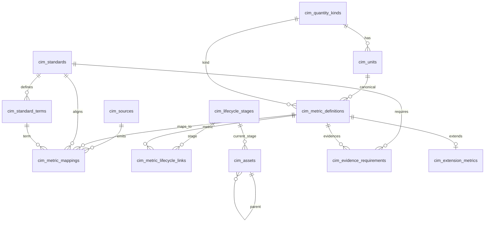

# Registry Database Model

> **Milestone 2** · Updated 2026-08-03  
> Additive ``cim_*`` schema for the registry-driven CIM. Coexists with legacy / Antigravity tables.

---

## 1. Design Principles

1. **Additive only** — new tables use the `cim_` prefix; existing tables (`metric_definitions`, `units`, `sources`, `cim_mappings`, `provenance_records`, …) are not renamed or dropped.
2. **Aligned with Milestone 1** — ORM models live in `cloud_metrics/models/cim_registry.py` and mirror the conceptual types under `cloud_metrics/registry/<name>/types.py`.
3. **Governance-first** — approved and candidate entries share the same tables, distinguished by `status` / `review_status` / `confidence_score`.
4. **Not wired to ingestion** — Milestone 2 does not change the ingestion pipeline or migrate legacy mapping data.

---

## 2. Entity Relationship Overview

---

## 3. Tables

| Table | Registry | Purpose |
|-------|----------|---------|
| `cim_quantity_kinds` | Unit | Physical quantity kinds (Energy, Power, …) |
| `cim_units` | Unit | Symbols, conversion factors, canonical links |
| `cim_sources` | Source | Telemetry origins (file, API, OTel, …) |
| `cim_assets` | Asset | Infrastructure / research asset hierarchy |
| `cim_standards` | Standards | External vocabularies / standards catalogue |
| `cim_standard_terms` | Standards | Terms within a standard |
| `cim_metric_definitions` | Metric | Canonical CIM metric namespaces |
| `cim_metric_mappings` | Mapping | Raw key → CIM metric (+ optional standard) |
| `cim_lifecycle_stages` | Lifecycle | RI lifecycle stages |
| `cim_metric_lifecycle_links` | Lifecycle | M2M metric ↔ stage |
| `cim_validation_rules` | Rule | Declarative validation rules |
| `cim_evidence_requirements` | Evidence | Reporting / certification evidence needs |
| `cim_provenance_records` | Provenance | Ingestion / mapping / transform lineage |
| `cim_extension_metrics` | Extension | Metrics outside covered standards |

---

## 4. Governance Columns

Applied to all `cim_*` registry tables (via `CimGovernanceMixin`):

| Column | Type | Default | Role |
|--------|------|---------|------|
| `id` | INTEGER PK | auto | Surrogate key |
| `status` | VARCHAR(64) | `draft` | Lifecycle: draft / candidate / approved / rejected / deprecated / retired / active |
| `review_status` | VARCHAR(64) | `pending` | Workflow: pending / under_review / approved / rejected |
| `confidence_score` | FLOAT | NULL | 0–1 confidence for candidates / mappings |
| `version` | INTEGER | 1 | Registry-row version |
| `created_at` | TIMESTAMPTZ | now | Audit |
| `updated_at` | TIMESTAMPTZ | now | Audit |
| `created_by` | VARCHAR(128) | NULL | Actor |
| `notes` | TEXT | NULL | Free-form rationale |

---

## 5. Capability Support

| Requirement | How supported |
|-------------|----------------|
| Approved + candidate entries | `status` + `review_status` on registry rows |
| Mapping confidence | `confidence_score` on `cim_metric_mappings` |
| Extension metrics | `cim_extension_metrics` → `cim_metric_definitions` |
| Multiple standards per metric | Multiple `cim_metric_mappings` rows (and/or evidence rows) with different `standard_id` |
| Multiple lifecycle stages per metric | `cim_metric_lifecycle_links` M2M |
| Provenance for ingest/map/transform | `cim_provenance_records.activity` |
| Validation rules | `cim_validation_rules` (`condition` JSON) |
| Evidence requirements | `cim_evidence_requirements` |

---

## 6. ORM Location

- Models: `cloud_metrics/models/cim_registry.py`
- Exports: `cloud_metrics.models` (`CimMetricDefinition`, `CimUnit`, …, `CIM_REGISTRY_TABLES`)
- Skeleton types (Milestone 1): `cloud_metrics/registry/*/types.py` — conceptual; not persistence

---

## 7. Coexistence with Prior Tables

| Milestone 2 table | Prior / Antigravity analogue (untouched) |
|-------------------|------------------------------------------|
| `cim_metric_definitions` | `metric_definitions` |
| `cim_units` / `cim_quantity_kinds` | `units` / `quantity_kinds` |
| `cim_sources` | `sources` |
| `cim_assets` | `assets` / `datacenters` |
| `cim_standards` / `cim_standard_terms` | `standards` / `metric_standard_map` |
| `cim_metric_mappings` | `cim_mappings` |
| `cim_provenance_records` | `provenance_records` |

Runtime code continues to use the prior tables until a later migration milestone switches services over.
