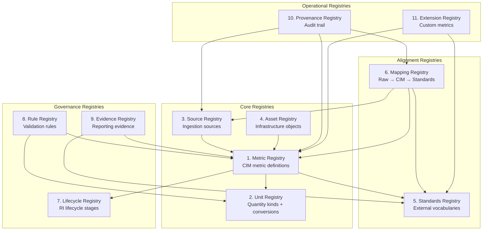
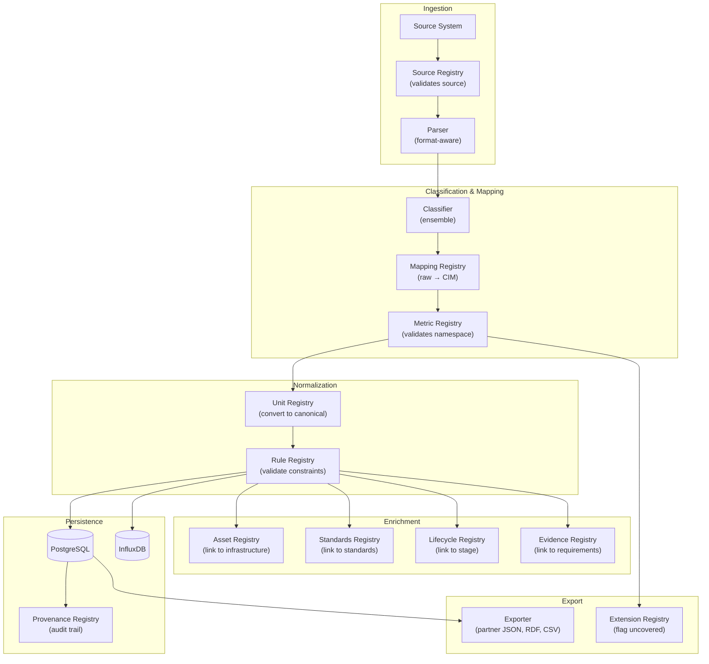

# Target Registry-Based CIM Architecture

> **Generated**: 2026-06-10 · **Scope**: Target architecture definition + current-state comparison

---

## 1. Design Philosophy

The target CIM architecture replaces the current ad-hoc, scattered mapping logic with a **registry-driven modular design**. Every concept in the system — metrics, units, sources, assets, standards, mappings, lifecycle stages, rules, evidence, provenance, and extensions — is governed by a dedicated registry with:

- **Controlled vocabulary**: each registry defines its own namespace and allowed values
- **Auditable state**: every mutation is tracked with provenance
- **Declarative rules**: validation is driven by registry data, not scattered `if` statements
- **Standards alignment**: all registries reference external vocabularies (SAREF, QUDT, PROV-O, etc.)
- **Separation of concerns**: ingestion, classification, mapping, and reporting are independent services that read from registries

---

## 2. Registry Overview

---

## 3. Registry Definitions

### 3.1 Metric Registry

**Purpose**: The canonical source of truth for all CIM metric definitions.

**Current coverage**: Partially covered by `metric_definitions` table + `categories`/`subcategories` tables + hardcoded dicts in classifiers.

| Field | Type | Description | Current Coverage |
|-------|------|-------------|-----------------|
| `id` | UUID | Primary key | ✅ integer PK in `metric_definitions` |
| `namespace` | VARCHAR | Full CIM namespace (e.g., `gd.energy.consumption.total_kwh`) | ✅ `unified_key` field |
| `label` | VARCHAR | Human-readable name | ❌ Missing |
| `description` | TEXT | Detailed description | ❌ Missing |
| `domain` | ENUM | energy, performance, network, storage, environment | 🟡 Implicit in category name |
| `category` | VARCHAR | FK→categories | ✅ via taxonomy tables |
| `subcategory` | VARCHAR | FK→subcategories | ✅ via taxonomy tables |
| `quantity_kind` | VARCHAR | FK→unit_registry (e.g., Energy, Power, Temperature) | ❌ Missing |
| `canonical_unit` | VARCHAR | FK→unit_registry (e.g., kWh, W, °C) | ❌ Missing |
| `metric_type` | ENUM | observed, calculated, derived, aggregated, reported | ❌ Missing |
| `status` | ENUM | draft, active, deprecated, retired | ❌ Missing |
| `tags` | JSON | Classification tags | ✅ `tags` field |
| `sources` | JSON | Source system references | 🟡 stores datacenter names, not source systems |
| `version` | INTEGER | Schema version | ❌ Missing |
| `created_at` | TIMESTAMP | Creation timestamp | ✅ Exists |
| `updated_at` | TIMESTAMP | Last update | ❌ Missing |

---

### 3.2 Unit Registry

**Purpose**: Controlled vocabulary for units, quantity kinds, conversion factors, and unit validation.

**Current coverage**: Almost entirely missing. `unit_normalizer.py` extracts units via regex but does not validate or convert.

| Field | Type | Description | Current Coverage |
|-------|------|-------------|-----------------|
| `id` | UUID | Primary key | ❌ Missing |
| `symbol` | VARCHAR | Unit symbol (e.g., kWh, W, °C, GB) | ❌ Missing |
| `name` | VARCHAR | Full name (e.g., kilowatt-hour) | ❌ Missing |
| `quantity_kind` | VARCHAR | Physical quantity (Energy, Power, Temperature, DataSize) | ❌ Missing |
| `si_base` | BOOLEAN | Whether this is an SI base unit | ❌ Missing |
| `canonical_unit_id` | FK | The canonical unit for this quantity kind | ❌ Missing |
| `conversion_factor` | FLOAT | Multiplier to canonical unit | ❌ Missing |
| `conversion_offset` | FLOAT | Offset to canonical unit (e.g., °F→°C) | ❌ Missing |
| `qudt_uri` | VARCHAR | QUDT vocabulary URI | ❌ Missing |
| `saref_uri` | VARCHAR | SAREF vocabulary URI | ❌ Missing |

**Required conversions**: Wh→kWh, W→kW, MB→GB→TB, Mbps→Gbps, °F→°C, bytes→KB→MB→GB

---

### 3.3 Source Registry

**Purpose**: Defines all metric source systems — files, APIs, monitoring tools, telemetry collectors.

**Current coverage**: Minimal. The `datacenters` table captures datacenter names but not source system types. The `file_upload_logs` table tracks uploads but not source capabilities.

| Field | Type | Description | Current Coverage |
|-------|------|-------------|-----------------|
| `id` | UUID | Primary key | ❌ Missing (conceptually dc.id) |
| `name` | VARCHAR | Source system name | 🟡 `datacenters.name` |
| `type` | ENUM | file, api, prometheus, opentelemetry, scaphandre, manual | ❌ Missing |
| `protocol` | VARCHAR | HTTP, gRPC, file, MQTT, etc. | ❌ Missing |
| `format` | VARCHAR | JSON, YAML, CSV, XML, Prometheus exposition, OTLP | ❌ Missing |
| `schema_version` | VARCHAR | Source schema version | ❌ Missing |
| `capabilities` | JSON | What metrics this source can provide | ❌ Missing |
| `auth_method` | ENUM | none, token, api_key, oauth2 | ❌ Missing |
| `status` | ENUM | active, inactive, deprecated | ❌ Missing |
| `metadata` | JSONB | Source-specific configuration | ❌ Missing |
| `created_at` | TIMESTAMP | | 🟡 `datacenters.created_at` |

---

### 3.4 Asset Registry

**Purpose**: Models the infrastructure hierarchy — from data centres down to individual CPUs/GPUs, plus research objects (datasets, experiments, workflows).

**Current coverage**: Very limited. Only `datacenters` table. No hierarchy of nodes, racks, servers, VMs, containers.

| Field | Type | Description | Current Coverage |
|-------|------|-------------|-----------------|
| `id` | UUID | Primary key | ❌ Missing |
| `name` | VARCHAR | Asset name | 🟡 `datacenters.name` (top-level only) |
| `type` | ENUM | datacenter, cluster, rack, node, server, cpu, gpu, storage_system, network_device, vm, container, service, workflow, dataset, experiment | ❌ Only 'datacenter' |
| `parent_id` | FK→self | Hierarchical parent | ❌ No hierarchy |
| `location` | VARCHAR | Physical location | 🟡 `datacenters.location` |
| `provider` | VARCHAR | Vendor/provider | 🟡 `datacenters.provider` |
| `specifications` | JSONB | Hardware/software specs | ❌ Missing |
| `lifecycle_stage` | FK→lifecycle | Current lifecycle stage | ❌ Missing |
| `status` | ENUM | active, inactive, decommissioned | ❌ Missing |
| `metadata` | JSONB | Custom attributes (ri_id, node_id, vm_id, host) | 🟡 Stored per-sample in `metric_samples`, not per-asset |

---

### 3.5 Standards Registry

**Purpose**: Catalogs external standards and vocabularies for alignment.

**Current coverage**: Good foundation. `standards` table has 12 seeded standards. `metric_standard_map` links metrics to standards with confidence scores.

| Field | Type | Description | Current Coverage |
|-------|------|-------------|-----------------|
| `id` | UUID | Primary key | ✅ `standards.id` |
| `code` | VARCHAR | Standard code (e.g., ISO-50001) | ✅ `standards.code` |
| `name` | VARCHAR | Full name | ✅ `standards.name` |
| `url` | VARCHAR | Official URL | ✅ `standards.url` |
| `description` | TEXT | Description | ✅ `standards.description` |
| `vocabulary_type` | ENUM | standard, ontology, vocabulary, convention | ❌ Missing |
| `namespace_prefix` | VARCHAR | URI prefix (e.g., saref:, qudt:, prov:) | ❌ Missing |
| `namespace_uri` | VARCHAR | Full namespace URI | ❌ Missing |
| `version` | VARCHAR | Standard version | ❌ Missing (embedded in code) |
| `domain` | ENUM | energy, environment, IT, semantic_web | ❌ Missing |
| `status` | ENUM | active, superseded, draft | ❌ Missing |

**Missing standards/vocabularies**: SAREF, SOSA/SSN, QUDT, schema.org, PROV-O, DCAT, RO-Crate, OpenTelemetry semantic conventions, EN 50600, OCP, ISO 14040/14044

---

### 3.6 Mapping Registry

**Purpose**: Stores the canonical mappings between raw source metrics, CIM namespaces, and external standards — with semantic relation types.

**Current coverage**: Fragmented across 5 stores (metric_source_map, metric_keywords, metric_mapping.json ×2, hardcoded dicts). No relation types.

| Field | Type | Description | Current Coverage |
|-------|------|-------------|-----------------|
| `id` | UUID | Primary key | ❌ Missing |
| `source_key` | VARCHAR | Raw metric key from source | 🟡 Scattered across tables |
| `source_id` | FK→source_registry | Which source system | ❌ Missing |
| `cim_metric_id` | FK→metric_registry | Target CIM metric | 🟡 Via unified_key string |
| `standard_id` | FK→standards_registry | External standard reference | 🟡 Via `metric_standard_map` |
| `relation_type` | ENUM | exactMatch, closeMatch, broadMatch, narrowMatch, inputToKPI, derivedFrom, contextualMatch, extensionMetric, noMatch, underReview | ❌ Missing (only binary mapped/unmapped) |
| `confidence` | FLOAT | Mapping confidence (0–1) | 🟡 In `metric_standard_map.confidence` and `clf_confidence` |
| `rationale` | TEXT | Why this mapping was chosen | 🟡 `clf_rationale` in samples |
| `approved_by` | VARCHAR | Human approver | ❌ Missing |
| `approved_at` | TIMESTAMP | Approval timestamp | 🟡 Model exists in `metric_mappings` but unused |
| `status` | ENUM | proposed, approved, rejected, deprecated | 🟡 Model exists in `mapping_proposals` but unused |
| `version` | INTEGER | Mapping version | 🟡 Model exists in `metric_mappings` but unused |

---

### 3.7 Lifecycle Registry

**Purpose**: Links metrics and assets to Research Infrastructure lifecycle stages.

**Current coverage**: Completely missing.

| Field | Type | Description | Current Coverage |
|-------|------|-------------|-----------------|
| `id` | UUID | Primary key | ❌ Missing |
| `stage` | ENUM | planning, design, procurement, deployment, operation, optimisation, reproducibility, reporting, continuous_improvement, decommissioning | ❌ Missing |
| `label` | VARCHAR | Human-readable label | ❌ Missing |
| `description` | TEXT | Stage description | ❌ Missing |
| `applicable_metrics` | FK→metric_registry (M2M) | Metrics relevant to this stage | ❌ Missing |
| `applicable_assets` | FK→asset_registry (M2M) | Assets in this stage | ❌ Missing |
| `sequence` | INTEGER | Ordering | ❌ Missing |

---

### 3.8 Rule Registry

**Purpose**: Declarative validation rules that are enforced during ingestion and export.

**Current coverage**: Rules are scattered as implicit `if` checks in code, not data-driven.

| Target Rule | Current Implementation |
|-------------|----------------------|
| Every metric must have a namespace | ✅ `to_gd()` ensures `gd.*` prefix |
| Every numeric metric must have a unit | ❌ Unit is optional nullable field |
| Every observed metric must have timestamp + source | 🟡 `captured_at` is required in `metric_samples`, `source_file` is optional |
| Every energy metric must distinguish power from energy | ❌ No validation (kW vs kWh ambiguity possible) |
| Every calculated metric must have a formula | ❌ No formula storage |
| Every reportable KPI must have boundary + aggregation period | ❌ No KPI metadata |

| Field | Type | Description | Current Coverage |
|-------|------|-------------|-----------------|
| `id` | UUID | Primary key | ❌ Missing |
| `name` | VARCHAR | Rule name | ❌ Missing |
| `description` | TEXT | Rule description | ❌ Missing |
| `rule_type` | ENUM | required_field, type_check, range_check, cross_field, formula | ❌ Missing |
| `target_registry` | ENUM | metric, unit, source, mapping, etc. | ❌ Missing |
| `condition` | JSONB | Rule condition (JSONLogic or similar) | ❌ Missing |
| `severity` | ENUM | error, warning, info | ❌ Missing |
| `status` | ENUM | active, disabled | ❌ Missing |

---

### 3.9 Evidence Registry

**Purpose**: Links metrics to evidence requirements for reporting, assessment, and certification readiness.

**Current coverage**: Completely missing.

| Field | Type | Description | Current Coverage |
|-------|------|-------------|-----------------|
| `id` | UUID | Primary key | ❌ |
| `standard_id` | FK→standards | Which standard requires this | ❌ |
| `metric_id` | FK→metric_registry | Which metric is needed | ❌ |
| `evidence_type` | ENUM | measurement, calculation, document, audit | ❌ |
| `requirement_level` | ENUM | mandatory, recommended, optional | ❌ |
| `reporting_period` | VARCHAR | annual, quarterly, monthly, continuous | ❌ |
| `aggregation_method` | ENUM | sum, average, max, min, count | ❌ |
| `boundary` | VARCHAR | site, facility, IT, total | ❌ |
| `description` | TEXT | Evidence description | ❌ |

---

### 3.10 Provenance Registry

**Purpose**: Automatic audit trail for every data transformation in the pipeline.

**Current coverage**: Minimal. `mapping_events` model exists but is never written to. `clf_confidence`/`clf_rationale` on samples is the only provenance captured.

| Field | Type | Description | Current Coverage |
|-------|------|-------------|-----------------|
| `id` | UUID | Primary key | ❌ Missing |
| `entity_type` | ENUM | metric_sample, mapping, metric_definition | ❌ Missing |
| `entity_id` | UUID | FK to affected entity | ❌ Missing |
| `activity` | ENUM | ingestion, classification, mapping, unit_conversion, aggregation, export, approval | ❌ Missing |
| `agent` | VARCHAR | System/user that performed the activity | ❌ Missing |
| `started_at` | TIMESTAMP | Activity start | ❌ Missing |
| `ended_at` | TIMESTAMP | Activity end | ❌ Missing |
| `inputs` | JSONB | Input data/references | 🟡 `clf_rationale` captures classification input |
| `outputs` | JSONB | Output data/references | ❌ Missing |
| `method` | VARCHAR | Algorithm/rule used | 🟡 `clf_rationale` has classifier name |
| `confidence` | FLOAT | Confidence score | 🟡 `clf_confidence` in samples |
| `prov_uri` | VARCHAR | PROV-O URI if applicable | ❌ Missing |

---

### 3.11 Extension Registry

**Purpose**: Stores new CIM-defined metrics not yet covered by external standards.

**Current coverage**: Implicit. Any metric that gets `gd.uncategorized.*` or `gd.custom.*` is effectively an extension, but there's no structured process.

| Field | Type | Description | Current Coverage |
|-------|------|-------------|-----------------|
| `id` | UUID | Primary key | ❌ Missing |
| `metric_id` | FK→metric_registry | The extended metric | ❌ Missing |
| `proposed_standard` | VARCHAR | Which standard should adopt this | ❌ Missing |
| `justification` | TEXT | Why this metric is needed | ❌ Missing |
| `status` | ENUM | proposed, accepted, submitted_to_standard, adopted | ❌ Missing |
| `proposed_by` | VARCHAR | Who proposed it | ❌ Missing |
| `proposed_at` | TIMESTAMP | When | ❌ Missing |

---

## 4. Target Data Flow

---

## 5. Current vs. Target Comparison Matrix

| Registry | Current State | Gap Level |
|----------|--------------|-----------|
| **1. Metric Registry** | Partial (`metric_definitions` + taxonomy tables + hardcoded dicts) | 🟡 Medium — needs schema expansion |
| **2. Unit Registry** | Missing (regex extraction only, no validation/conversion) | 🔴 Complete gap |
| **3. Source Registry** | Minimal (`datacenters` only, no source type/capabilities) | 🔴 Near-complete gap |
| **4. Asset Registry** | Minimal (`datacenters` only, no hierarchy) | 🔴 Near-complete gap |
| **5. Standards Registry** | Good foundation (12 standards, linkage with confidence) | 🟢 Extend |
| **6. Mapping Registry** | Fragmented (5 stores, no relation types, unused tables) | 🟡 Major refactor |
| **7. Lifecycle Registry** | Missing | 🔴 Complete gap |
| **8. Rule Registry** | Missing (rules are implicit in code) | 🔴 Complete gap |
| **9. Evidence Registry** | Missing | 🔴 Complete gap |
| **10. Provenance Registry** | Minimal (unused `mapping_events`, `clf_*` on samples) | 🔴 Near-complete gap |
| **11. Extension Registry** | Missing | 🔴 Complete gap |

**Summary**: 6 registries are complete gaps, 2 are near-complete gaps, 2 need significant work, 1 has a good foundation.
